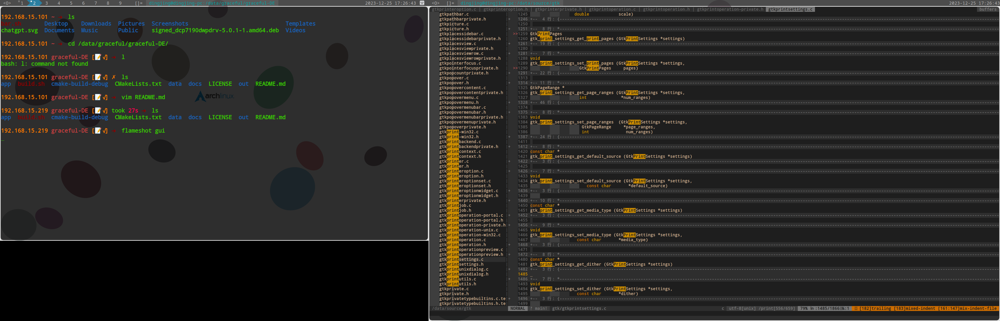

# graceful-DE
> 一款轻便的瓷贴桌面环境



## 依赖

- feh
- yajl
- ibus
- dbus
- pcre
- glib2
- libxft
- libx11
- libdrm
- libxext
- libglvnd
- libxfixes
- libxrandr
- libconfig
- ibus-rime
- fontconfig
- terminator
- libxrender
- libxdamage
- libxinerama
- libxcomposite

## 支持功能

这个项目整合了 `dwm` `compton`，实现功能如下：

- [x] 双屏支持
- [x] 屏幕透明

## 常用快捷键

|快捷键|说明|
|------|----|
|`Alt` + `Enter`|打开terminator终端|
|`Alt` + `Left`|窗口焦点移动到左边窗口(Left表示方向左键)|
|`Alt` + `Right`|窗口焦点移动到右边窗口(Right表示方向右键)|
|`Alt` + `Up`|窗口焦点移动到下一个显示器(双屏里有效，Up表示方向键上键)|
|`Alt` + `Down`|窗口焦点移动到下一个显示器(双屏里有效，Down表示方向键下键)|
|`Alt` + `Shift` + `<数字>`|把当前窗口移动到本屏幕指定`<数字>`的工作区|
|`Alt` + `<数字>`|切换到指定`<数字>`工作区|
|`Alt` + `k`|退出当前焦点窗口|

> 注意：<br/>
> 启动后整个窗口管理器没有选中任何工作区，所以要先切换到某个工作区再启动图形客户端，否则打开的图形客户端都在1工作区，而且屏幕上看不到。

## 双屏注意事项

如果你也使用两个显示器，那么最好打开 `/usr/bin/start-graceful-linux`脚本，修改`start xrandr --output <...>` 开头那一行中的显示器名字（显示器名字是跟在 `--output` 选项后的字符串，这个字符串通过执行xrandr命令获取）

## 安装

### archlinux 安装使用

进入源码目录执行 `./build.sh` 即可在当前目录`out/`下生成 `pacman` 的安装包，执行`pacman -U out/graceful-linux-<具体版本>-0-x86_64.pkg.tar.zst` 安装即可

### 其他Linux版本使用

进入源码目录执行：
```shell
cmake -B build . && make -C build && sudo make -C build install
```

> 安装后在登出系统，在登录管理器那里选择 `GracefulLinux` session并登录即可

## 待实现功能

- [ ] 锁屏
- [ ] 添加主题支持
- [ ] 登出操作(目前可以使用 systemctl restart <显示管理器名，比如gdm、lightdm>登出) 
